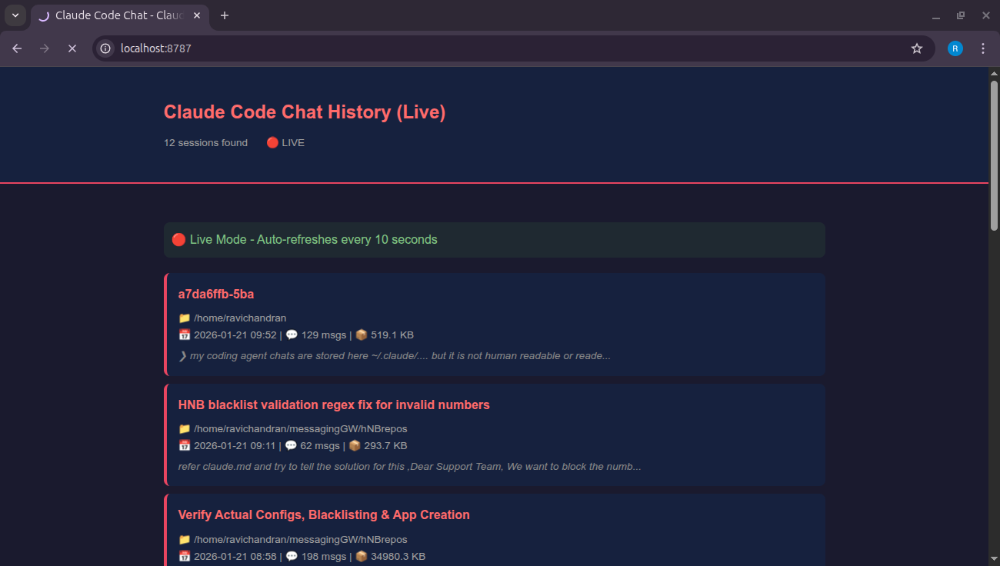

# Claude Code Chat Viewer

A beautiful, human-readable viewer for your [Claude Code](https://claude.ai/claude-code) conversation history.

Claude Code stores your chat sessions in JSONL format at `~/.claude/` - which is not exactly easy to read. This tool converts those conversations into beautifully styled HTML pages that you can browse in your web browser.



## Features

- **Live Server Mode**: Auto-refreshing web interface that shows your chats in real-time
- **Static HTML Generation**: Generate standalone HTML files you can share or archive
- **Dark Theme**: Easy on the eyes with a modern dark interface
- **Syntax Highlighting**: Code blocks are properly formatted
- **Tool Calls Display**: See what tools Claude used (Bash, Read, Write, etc.)
- **Thinking Blocks**: Expandable sections showing Claude's reasoning
- **Session Index**: Browse all your sessions sorted by date
- **Search/Filter**: Filter sessions by project path

## Installation

### Quick Start

```bash
# Clone the repository
https://github.com/Kirushanthan03/claude-code-chat-history-viewer
cd claude-code-chat-viewer

# Make executable (optional)
chmod +x claude_chat_viewer.py

# Run it!
./claude_chat_viewer.py --serve
```

### Add to PATH (optional)

To run from anywhere:

```bash
# Option 1: Symlink to ~/bin
mkdir -p ~/bin
ln -s $(pwd)/claude_chat_viewer.py ~/bin/claude-chat-viewer

# Option 2: Add to .bashrc/.zshrc
echo 'alias claude-chat-viewer="/path/to/claude_chat_viewer.py"' >> ~/.bashrc
source ~/.bashrc
```

## Usage

### Live Server (Recommended)

Start a local web server that auto-refreshes as you chat:

```bash
./claude_chat_viewer.py --serve
```

This will:
- Start a server at `http://localhost:8787`
- Open your browser automatically
- Refresh the session list every 10 seconds
- Refresh individual chats every 5 seconds

**Custom port:**
```bash
./claude_chat_viewer.py --serve -P 9000
```

### Static HTML Generation

Generate HTML files that you can open offline:

```bash
# Generate all sessions
./claude_chat_viewer.py

# Output to specific directory
./claude_chat_viewer.py -o ~/my-chat-archive

# Open in browser after generating
./claude_chat_viewer.py --open

# Limit number of sessions
./claude_chat_viewer.py -n 20
```

### List Sessions

View all your sessions in the terminal:

```bash
./claude_chat_viewer.py --list
```

Output:
```
╔══════════════════════════════════════════════════════════╗
║              Claude Code Chat Sessions                   ║
╚══════════════════════════════════════════════════════════╝

  1. [a7da6ffb] 2024-01-21 09:14
     📁 /home/user/my-project
     💬 30 messages | 151.7 KB
     📝 Implementing new feature
     Preview: Help me add authentication to...

  2. [c55009e3] 2024-01-21 08:30
     📁 /home/user/another-project
     💬 45 messages | 293.7 KB
     Preview: Fix the bug in the login flow...

Total: 12 sessions
```

### View Specific Session

```bash
# By session ID (partial match works)
./claude_chat_viewer.py -s a7da6ffb

# Filter by project
./claude_chat_viewer.py -p my-project
```

## Configuration

### Custom Claude Directory

If your Claude Code data is in a non-standard location:

```bash
./claude_chat_viewer.py --claude-dir /custom/path/.claude --serve
```

### Default Settings

You can modify these constants at the top of `claude_chat_viewer.py`:

```python
# Default Claude Code data directory
CLAUDE_DIR = Path.home() / ".claude"

# Where to output generated HTML files
DEFAULT_OUTPUT_DIR = Path.home() / "claude-chat-history"

# Live server default port
DEFAULT_PORT = 8787
```

## Command Reference

```
usage: claude_chat_viewer.py [-h] [--serve] [-P PORT] [-s SESSION] [-p PROJECT]
                             [-o OUTPUT] [--claude-dir CLAUDE_DIR] [--list]
                             [--open] [-n LIMIT]

Options:
  --serve               Start live web server (recommended)
  -P, --port PORT       Port for live server (default: 8787)
  -s, --session ID      View specific session by ID
  -p, --project PATH    Filter sessions by project path
  -o, --output DIR      Output directory for static HTML
  --claude-dir DIR      Claude Code data directory (default: ~/.claude)
  --list                List all sessions in terminal
  --open                Open in browser after generating
  -n, --limit N         Limit number of sessions (default: 50)
```

## Requirements

- Python 3.7+
- No external dependencies (uses only Python standard library)

## How It Works

Claude Code stores conversation history in:
```
~/.claude/
├── history.jsonl           # User prompts/commands
├── projects/
│   ├── -home-user-project1/
│   │   ├── session-id-1.jsonl
│   │   ├── session-id-2.jsonl
│   │   └── sessions-index.json
│   └── -home-user-project2/
│       └── ...
```

Each `.jsonl` file contains the full conversation with:
- User messages
- Assistant responses
- Tool calls (Bash, Read, Write, Edit, etc.)
- Thinking blocks (Claude's reasoning)
- Timestamps and metadata

This viewer parses these files and renders them as styled HTML.


## Contributing

Contributions are welcome! Feel free to:
- Report bugs
- Suggest features
- Submit pull requests

## License

MIT License - see [LICENSE](LICENSE) file.

## Acknowledgments

- Built for use with [Claude Code](https://claude.ai/claude-code) by Anthropic
- Inspired by the need to review and share coding sessions

---

**Note**: This is an unofficial community tool and is not affiliated with Anthropic.
